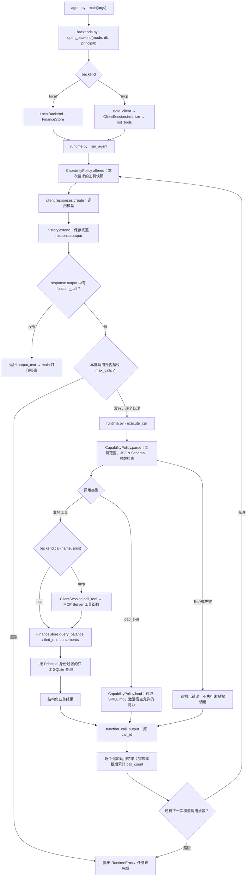

# Tools / Skills / MCP 可运行参考工程

用同一套业务函数展示两种执行方式：直接调用 Python，以及通过真实 stdio MCP Server 调用。数据库和进程通信是真实实现，种子数据为虚构财务记录。

阅读主文档：[工程实践指南](../tools-skills-mcp工程实践指南.md)。动态演示：[调用过程](../agent-flow.html)。

## 依赖与版本

- Python 3.11+。
- OpenAI Python SDK 2.54.0，使用 Responses API。
- MCP Python SDK 1.30.0，使用仍受维护的 1.x 兼容协议与初始化流程。
- SDK v2 与 MCP 2026-07-28 的新流程另见主文档；本工程不声称实现新协议。
- 本工程不依赖 LangChain，但需要 SDK、JSON Schema 和 YAML 库。

## 不需要 API Key 的验证

从此 README 所在目录运行：

```bash
python3 -m venv .venv
source .venv/bin/activate
python -m pip install -r requirements.lock.txt
python smoke.py
python -m pytest -q
```

也可用 `requirements.txt` 安装直接依赖；锁文件用于复现本次已验证的完整依赖版本。

烟雾检查分别打印 `local` 和 `mcp` 的余额与报销查询结果，断言两者一致。MCP 子进程 stdout 只用于协议通信，日志在 stderr。

## 连接真实模型

在自己的终端设置 `OPENAI_API_KEY`，不要把密钥写入源码或提交。然后运行：

```bash
python seed.py
export OPENAI_MODEL='gpt-4.1'
python agent.py '查询我的余额，再找一下办公设备报销单' --backend local
python agent.py '查询我的余额，再找一下办公设备报销单' --backend mcp
```

模型可改为自己账号中支持 Responses 工具调用的型号，使用环境变量或 `--model`。代码配置了单次模型请求超时与重试；整体任务另有步数和调用次数上限。真实调用需要网络和 API 费用，本次没有使用真实密钥联调。

CLI 默认绑定 `demo-a/alice`。本地演示身份也可以这样切换：

```bash
python agent.py '查询我的余额' --backend mcp --tenant demo-b --user alice
```

这是可信本地调试入口，不是身份认证方式。Web 服务须从验证后的登录会话构建 Principal，不能信任用户任意提交的身份参数。

## 流程与代码位置

下面的流程图对应实际函数和调用循环。MCP 模式在进入循环前建立兼容连接并发现工具；本地模式直接使用相同的业务函数。



`execute_call` 会把工具超时、执行失败和超大结果转成带 `call_id` 的结构化错误。模型响应未完成时，`run_agent` 直接报错；上述图只展开正常响应进入工具循环后的分支。

1. `catalog.py` 读取 Skill 元数据；最初只展示 `load_skill`。
2. 模型请求加载技能后，宿主按自己的能力配置展示业务工具。
3. `runtime.py` 遍历每个 function_call，校验当前工具快照和参数。
4. `backends.py` 选择本地调用或 MCP Client；两条路径复用 `business.py`。
5. 关联结果按 call_id 续传，允许模型继续查询，最终输出回答。

查询只能读取绑定主体的数据。模型参数没有 user_id / tenant_id，SQLite 查询使用身份过滤、参数绑定和只读连接。报销检索是字面子串 SQL，不是向量 RAG。

`parallel_tool_calls=False` 是模型请求设置；执行器仍遍历所有实际返回的调用。上下文保存整个任务的模型输出项，包括 reasoning 项。没有跨次 CLI 调用的聊天历史。

## 本次验证与限制

见 [VERIFICATION.md](VERIFICATION.md)。离线模型响应夹具验证 SDK 请求序列和工具循环，不能证明真实模型会正确选择技能或工具。

示例未实现远程认证、写操作审批、持久化会话、分布式并发、向量检索或生产监控平台。`asyncio.wait_for` 只限制可取消异步等待，不强制停止同步数据库查询；大规模部署需驱动层超时与受控执行环境。
